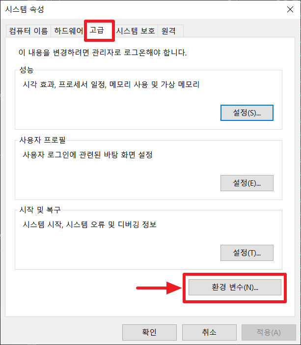

# 설치가이드

## Step 1/2 : Window에서 GCC 설치하기

Linux나 MacOS에서는 기본으로 있거나 쉽게 다운받을 수 있지만 Window는 약간 불편한 절차를 거쳐야 한다. gcc를 사용하기 위해 MinGW(Minimalist GNU for Window)를 받도록하자.

### 1. 아래 사이트에 들어가서 최신 버전을 받자

[http://mingw-w64.org/doku.php](http://mingw-w64.org/doku.php)

<br><br><br><br><br>

### 2. 여기를 누르면 Source Forge로 이동이 된다.


<br><br><br><br><br>

### 3. 우선 [Files]를 클릭한다.


<br><br><br><br><br>

### 4. 자기 운영체제의 비트(64 혹은 32)에 맞게 다운로드하면 된다. 필자는 64bit라서 X86_64를 받았다. 32bit라면 i686을 받으라.


<br><br><br><br><br>

### 5. 원하는 위치에 압축해제를 하면 된다. 필자는 C드라이브 안 내 컴퓨터의 사용자 디렉토리에 넣거나 Program Files에 넣는 것이 편하다. 나중에 환경변수를 설정해야하기 때문에 위치가 달라지면 곤란하기 때문이다. 압축푸는 데 시간이 좀 걸리는 것 같다. 약 1분...?


<br><br><br><br><br>

### 6. mingw64 폴더안에 bin 폴더가 있는데, 이 bin 폴더가 우리가 원하는 gcc가 있는 곳이다. g++로도 나중에 C++로 코딩된 소스(.cpp)를 컴파일할 수 있다.


<br><br><br><br><br>

### 7. 지금은 저 폴더에 들어가야 gcc.exe를 실행할 수 있지만, 이제 환경변수만 잡아주면 어느 위치에서든 저 gcc.exe를 실행할 수 있을 것이다.





<br><br><br><br><br>

### 8. 환경변수가 잘 적용되었는지 체크해보자.


```cmd
gcc --version
g++ --version
```


잘 되었다. 아주 훌륭하다.

<br><br><br><br><br>

<hr>

<br><br><br><br><br>

## Step 2/2 : IDE 셋팅 : Visual Studio Code

### 1. VS Code를 우선 받자. 아주 강려크하고 가벼운 고오급 메모장이니 즐겨쓰시길 바란다.

[https://code.visualstudio.com/](https://code.visualstudio.com/)

<br><br><br><br><br>

### 2. C언어 공부를 위한 Workspace를 만들기 위해 [새 폴더]를 만들자


<br><br><br><br><br>

### 3. 폴더 안에 들어가서 [Shift]를 누른 상태로 오른쪽 마우스를 누르면 현재 위치로 잡힌 PowerShell을 열 수 있다.


<br><br><br><br><br>

### 4. 이제 현위치를 기반으로하는 Visual Studio Code를 실행시키면된다.

```cmd
code .
```


필자는 VS Code를 계속 사용하고 있어서 갖가지 셋팅을 한 상태로 본인의 기본 화면과 다르다고 놀라지 말라.

<br><br><br><br><br>

### 5. 자~ 테스트를 위해 test.c라는 파일을 만들고 기본적인 C 코드를 짜보자

```c
#include <stdio.h>

int main()
{
    printf("Hello World");
}
```


<br><br><br><br><br>

### 6. [ Ctrl + ` ] 를 누르면 터미널이 실행된다.  gcc를 이용해 우리가 작성한 test.c를 컴파일하자.

```c
gcc test.c
```


<br><br><br><br><br>

### 7. 어떤 이름으로 출력(Output)시킬 것인지 지정하지 않았기 때문에 a.exe이라는 이름으로 파일이 생겨났다. 이제 이 파일을 실행하면 우리가 코딩한 대로 동작한다.


<br><br><br><br><br>

### 8. 매번 이렇게 컴파일하고 실행하는 일은 귀찮은 일이다. 이 일련의 과정들이 자동으로 처리되도록 확장 프로그램을 설치하자.


<br><br><br><br><br>

### 9. 설치 후에 어떻게 자동으로 실행하게 할 것인지 빌드 과제(Build Task)를 부여해야 한다. [Terminal > Configure Default Build Task...]를 선택하자


<br><br><br><br><br>

### 10. 그러면 똑똑하게 추천을 해준다. 우리가 원하는 건 gcc.exe 활성 파일 빌드다. 선택!


<br><br><br><br><br>

### 11. 다음과 같은 task.json이 만들어졌다. 이제 VS Code는 [Run]할 때마다 이 임무를 토대로 실행할 것이다. 이 task.json을 보면 알 수 있듯이 어떤 위치에 있는 실행 파일(gcc.exe)을 이용해 다음과 같은 명령(command) 줄을 실행한다.


<br><br><br><br><br>

### 12. [Ctrl + Alt + N] 이나 [Run] 버튼을 눌러서 아름다운 결과물을 보며 환경셋팅을 마치자


